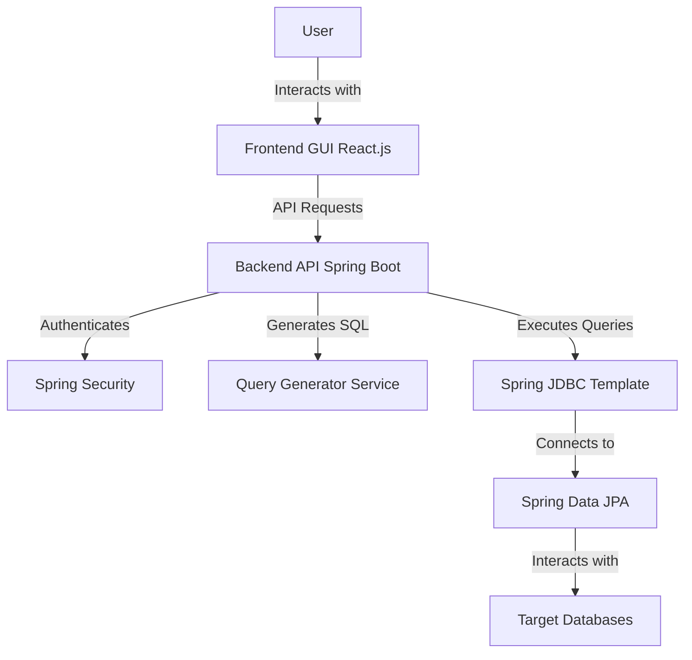

# RDBMS Management Dashboard

## Overview

This RDBMS Management Dashboard is a powerful, user-friendly GUI application that allows users to interact with relational databases without writing SQL commands directly. It provides functionality similar to phpMyAdmin, enabling users to perform database operations through an intuitive interface. The application generates and executes SQL commands based on user interactions.

## Features

- Connect to multiple RDBMS systems (e.g., MySQL, PostgreSQL, SQLite)
- Browse database structure (tables, views, stored procedures)
- Execute custom SQL queries
- Perform CRUD operations on tables through GUI
- Visual query builder for complex queries
- Data export and import functionality
- User authentication and access control

## Architecture and System Design

The application follows a client-server architecture with the following components:

1. **Frontend**: A web-based GUI built with React.js
2. **Backend API**: Java Spring Boot application
3. **Database Connectors**: Spring Data JPA with Hibernate
4. **Query Generator**: Custom Java service to convert GUI actions to SQL queries
5. **Query Executor**: Spring JDBC Template for executing SQL queries
6. **Authentication Service**: Spring Security for user authentication and authorization

### High-Level Architecture Diagram



## System Flow

1. User logs in to the dashboard
2. User selects a database to connect to
3. Dashboard displays the database structure
4. User interacts with the GUI to perform operations (e.g., select tables, create queries)
5. Frontend sends requests to the Spring Boot backend API
6. Backend generates SQL commands based on user actions
7. SQL commands are executed on the target database using Spring JDBC Template
8. Results are returned to the frontend and displayed to the user

## Setup and Installation

### Prerequisites

- Java JDK 11 or later
- Maven 3.6 or later
- Node.js 14 or later
- npm 6 or later

### Backend Setup

1. Clone the repository:
   ```
   git clone https://github.com/yourusername/rdbms-dashboard.git
   cd rdbms-dashboard/backend
   ```

2. Configure the application properties:
   - Open `src/main/resources/application.properties`
   - Update the database connection details and other configurations

3. Build and run the Spring Boot application:
   ```
   mvn spring-boot:run
   ```

### Frontend Setup

1. Navigate to the frontend directory:
   ```
   cd ../frontend
   ```

2. Install dependencies:
   ```
   npm install
   ```

3. Start the development server:
   ```
   npm start
   ```

4. Access the dashboard at `http://localhost:3000`

## Contributing

We welcome contributions to improve the RDBMS Management Dashboard. Please follow these steps to contribute:

1. Fork the repository
2. Create a new branch (`git checkout -b feature/AmazingFeature`)
3. Commit your changes (`git commit -m 'Add some AmazingFeature'`)
4. Push to the branch (`git push origin feature/AmazingFeature`)
5. Open a Pull Request

## License

This project is licensed under the MIT License - see the [LICENSE](LICENSE) file for details.

## Acknowledgments

- [React.js](https://reactjs.org/)
- [Spring Boot](https://spring.io/projects/spring-boot)
- [Spring Data JPA](https://spring.io/projects/spring-data-jpa)
- [Spring Security](https://spring.io/projects/spring-security)
- [Hibernate](https://hibernate.org/)
- [React Flow](https://reactflow.dev/) for visual query builder
